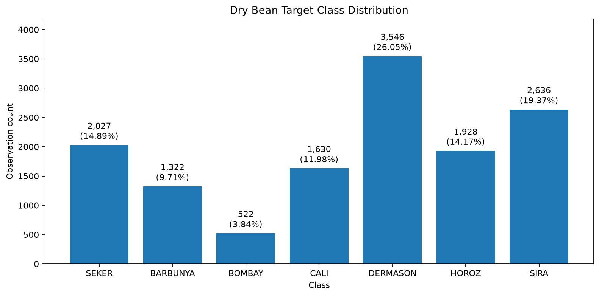
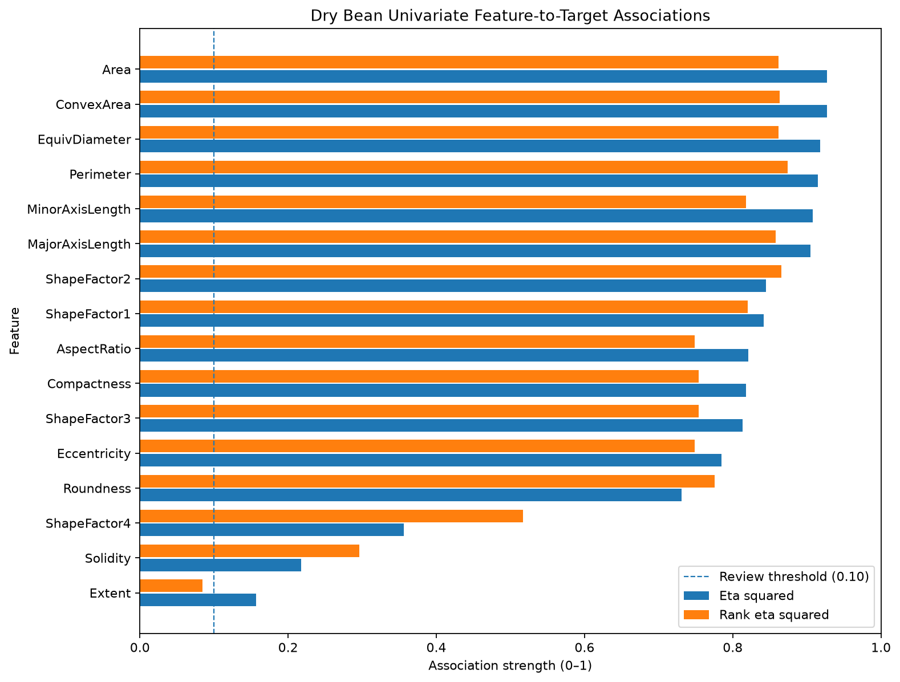
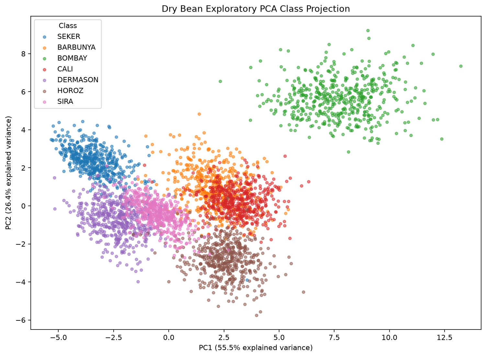
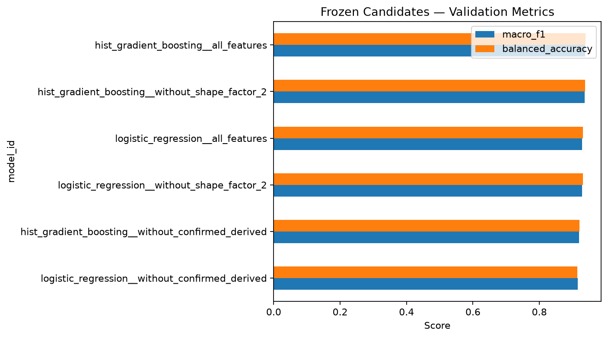
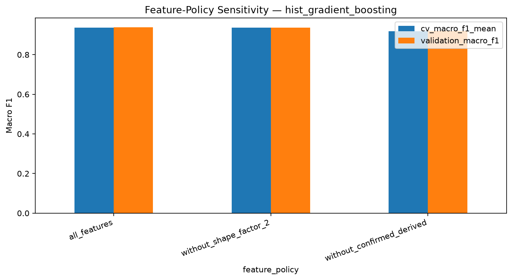
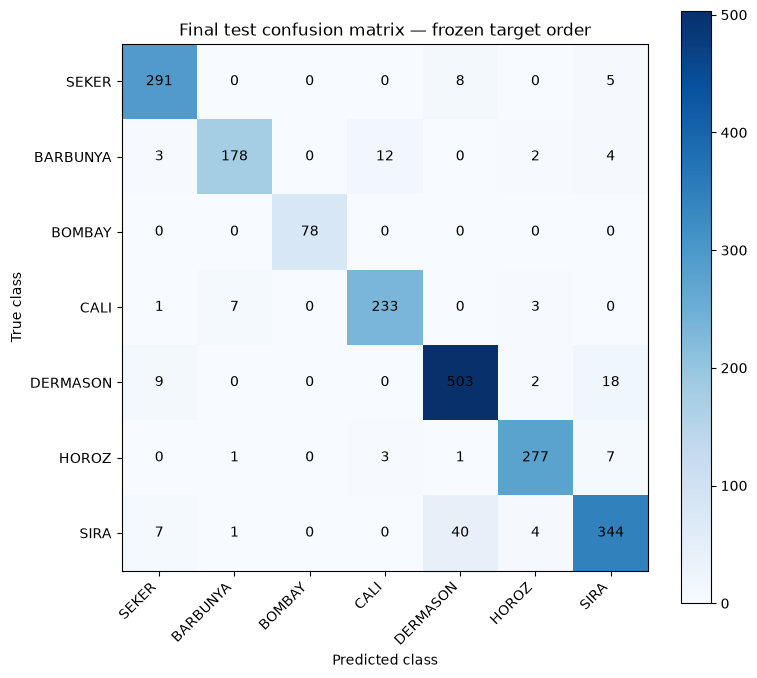
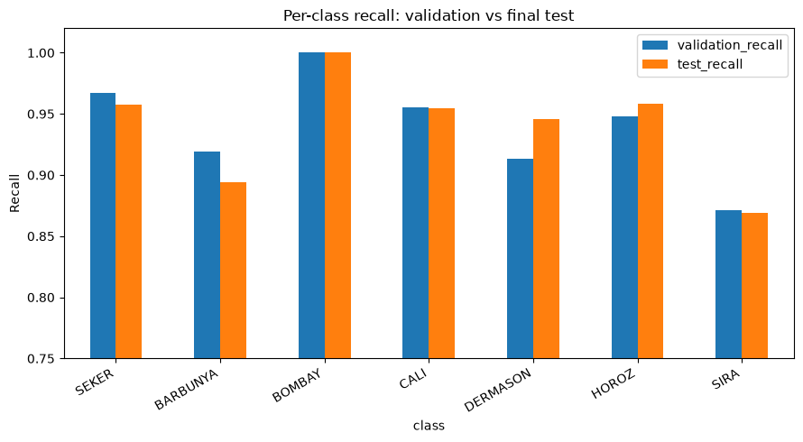

# Dry Bean Dataset Study

End-to-end reproducible educational study of the UCI Dry Bean dataset, covering source validation, exploratory evidence, deterministic preparation, multiclass model selection, sealed final holdout evaluation, model bundling, and trusted independent inference.

## At a glance

| Item | Result |
|---|---:|
| Source | UCI Machine Learning Repository, dataset `602` |
| Source rows | 13,611 |
| Source columns | 17 |
| Features | 16 numerical morphology features |
| Target | `Class` |
| Classes | 7 nominal, unordered bean varieties |
| Selected model | HistGradientBoostingClassifier |
| Selected feature policy | `all_features` |
| Primary metric | macro F1 |
| Final test macro F1 | 0.941835 |
| Final test balanced accuracy | 0.939897 |
| Educational study complete | Yes |
| Operational modeling ready | No |

## Study Objective

This repository documents a frozen educational multiclass classification workflow for dry bean grain varieties. The notebooks keep the scientific decisions visible, while Python modules and tests enforce reusable contracts for data preparation, model selection, finalization, and independent inference.

The study does not claim production readiness, operational validity, temporal validity, or an implemented deployment/API surface.

## Dataset And Source

The dataset is the UCI Machine Learning Repository **Dry Bean** dataset:

| Field | Value |
|---|---|
| UCI dataset ID | `602` |
| Repository URL | <https://archive.ics.uci.edu/dataset/602/dry+bean+dataset> |
| Dataset DOI | `10.24432/C50S4B` |
| Intro paper | "Multiclass classification of dry beans using computer vision and machine learning techniques" |
| Paper DOI | `10.1016/j.compag.2020.105507` |

The source contains 16 numerical image-derived features and one nominal target column, `Class`. No source identifier is available, so exact-row equality is not treated as duplicate identity.

Classes, in the official output order used by this study:

```text
SEKER
BARBUNYA
BOMBAY
CALI
DERMASON
HOROZ
SIRA
```

## Workflow

```text
Raw UCI snapshot
    -> 01 data understanding and exploration
    -> 02 deterministic preparation and stratified split
    -> 03 model selection on train/validation only
    -> 04 final train+validation fit and sealed test evaluation
    -> 05 independent inference demonstration
```

Each notebook depends on persisted artifacts, not live variables from a previous notebook.

## Data Quality And Preparation

The prepared dataset preserves the source shape exactly:

| Check | Result |
|---|---:|
| Source rows | 13,611 |
| Prepared rows | 13,611 |
| Source columns | 17 |
| Prepared columns | 17 |
| Row removal | None |
| Deterministic materialization rules | None |
| Candidate features retained | 16 of 16 |
| Learned preprocessing in Notebook 02 | None |

The source SHA and logical source fingerprint are preserved. The static split is stratified:

| Partition | Rows |
|---|---:|
| Train | 9,527 |
| Validation | 2,042 |
| Test | 2,042 |

The test partition remained sealed until the final evaluation in Notebook 04.

Repeated feature profiles were preserved because there is no source identifier. Repeated-profile evidence does not prove duplicate identity or leakage.

## Exploratory Evidence

The target has moderate class-support imbalance. `DERMASON` is the majority class and `BOMBAY` is the minority class; the majority/minority ratio is about 6.7931 and normalized class entropy is about 0.942737.



Several morphology measurements show strong univariate association with `Class`, and the feature set includes structural redundancy plus confirmed mathematical dependencies. These findings are descriptive and do not by themselves justify feature removal.



The PCA projection is exploratory visualization only. It shows class overlap and should not be read as a classifier or a causal explanation.



Additional curated evidence is available in `docs/images/numerical_feature_correlation_heatmap.png` and `docs/images/standardized_class_profiles.png`.

## Model Selection

Notebook 03 compares four candidate families under the frozen multiclass contract:

- LogisticRegression
- DecisionTreeClassifier
- RandomForestClassifier
- HistGradientBoostingClassifier

The selected model is:

| Field | Value |
|---|---|
| `selected_model_id` | `hist_gradient_boosting__all_features` |
| Feature policy | `all_features` |
| Feature count | 16 |
| Numerical scaling | none |
| Categorical processing | not applicable |
| Imbalance strategy | none |
| `class_weight` | `None` |
| Resampling | none |

Selected hyperparameters:

```text
class_weight       = None
l2_regularization = 0.0
learning_rate     = 0.05
max_iter          = 250
max_leaf_nodes    = 15
min_samples_leaf  = 40
random_state      = 42
```

Validation evidence for the selected model:

| Metric | Validation |
|---|---:|
| macro F1 | 0.937881 |
| balanced accuracy | 0.939131 |
| log loss | 0.225172 |
| worst per-class recall | 0.870886 |



`ShapeFactor2` remains in the final feature set. Its audited formula was not numerically confirmed at the configured tolerance, so `provenance_status = unresolved`; that does not mean the feature is invalid. Predictive usefulness and source provenance are separate questions. Removing `ShapeFactor2` changed validation macro F1 by about -0.001204 relative to all features.

The confirmed-derived-feature ablation also supported retaining all 16 features: validation macro F1 was about 0.937881 with all features and about 0.919956 without the nine confirmed derived features, a delta of about -0.017925.



## Final Holdout Evaluation

Notebook 04 trained the frozen selected model once on train plus validation and evaluated the sealed test partition once.

| Metric | Final test |
|---|---:|
| macro F1 | 0.9418353636 |
| balanced accuracy | 0.9398971908 |
| macro recall | 0.9398971908 |
| weighted F1 | 0.9321874639 |
| accuracy | 0.9324191969 |
| log loss | 0.1810239003 |
| minimum per-class recall | 0.8686868687 |
| worst class | SIRA |



The largest mutual confusion pairs were stable from validation to test:

| Pair | Final test mutual errors |
|---|---:|
| DERMASON <-> SIRA | 58 |
| BARBUNYA <-> CALI | 19 |

This is descriptive stability of the confusion pattern, not a causal claim. Test minus validation macro F1 was about +0.003954, and balanced accuracy delta was about +0.000766. This comparison is not a new selection gate.



Additional final comparison evidence is available in `docs/images/validation_vs_test_metrics.png`.

## Independent Multiclass Inference

Notebook 05 demonstrates trusted independent inference from:

```text
final-model-handoff.v2
inference-bundle.v2
final-pipeline.joblib
```

The inference input contract requires the same 16 numerical features. `Class` is prohibited as input, and missing required values are rejected.

The output contract contains:

- `predicted_class`
- `class_order`
- `class_probabilities`

The decision rule is `argmax_class_score_or_probability`. The estimator class order is:

```text
BARBUNYA
BOMBAY
CALI
DERMASON
HOROZ
SEKER
SIRA
```

The official output class order is:

```text
SEKER
BARBUNYA
BOMBAY
CALI
DERMASON
HOROZ
SIRA
```

Probabilities are explicitly realigned from estimator order to the official output order. There is no positive-class probability, binary threshold, or operational decision threshold in the multiclass inference contract.

## Project Structure

```text
artifacts/          Artifact documentation and ignored runtime outputs
data/               Data documentation and ignored raw/processed datasets
docs/images/        Curated versionable figures for documentation
notebooks/          Five authoritative source notebooks
scripts/            Reusable validation, analysis, selection, finalization, and inference code
tests/              Unit and contract tests
```

No deployment/API implementation is part of this study.

## Environment Setup

Install the project with notebook and test dependencies:

```bash
python -m pip install -e ".[notebook,test]"
```

Register an optional Jupyter kernel:

```bash
python -m ipykernel install --user \
  --name dataset-study-dry-bean \
  --display-name "Python (dataset-study-dry-bean)"
```

The final bundle records this exact runtime:

| Component | Version |
|---|---:|
| Python | 3.13.13 |
| pandas | 3.0.5 |
| scikit-learn | 1.9.0 |
| joblib | 1.5.3 |

## Reproducing The Study

Acquire the UCI dataset:

```bash
python -m scripts.download_data uci \
  602 \
  --destination data/raw/dry-bean
```

Run notebooks in order from 01 to 05. Keep the source notebooks clean by executing copies instead of using `--inplace`:

```bash
jupyter nbconvert --to notebook --execute notebooks/01_data_understanding_and_exploration.ipynb
jupyter nbconvert --to notebook --execute notebooks/02_data_preparation.ipynb
jupyter nbconvert --to notebook --execute notebooks/03_model_selection_and_evaluation.ipynb
jupyter nbconvert --to notebook --execute notebooks/04_final_model_and_bundle.ipynb
jupyter nbconvert --to notebook --execute notebooks/05_inference_demo.ipynb
```

The generated `*.nbconvert.ipynb` files are ignored by Git.

## Tests

Run:

```bash
PYTHONPATH=. python -m pytest -q
```

The tests include backward compatibility for v1 binary contracts while keeping the Dry Bean workflow on the v2 multiclass contract.

## Reproducibility And Integrity

The repository intentionally keeps raw data, processed data, model binaries, and runtime artifacts out of the normal versioned workflow. Tests should not pass only because local runtime artifacts happen to exist.

Versioned notebooks are kept without code-cell outputs or execution counts. Curated documentation figures live in `docs/images/`; future legitimate notebook executions export those figures through `scripts/export_figures.py`.

## Limitations

This is an educational static-snapshot benchmark. Operational validity is unconfirmed, feature availability at real inference time is unconfirmed, and no API or deployment layer is implemented.

Repeated-profile final-test sensitivity was descriptive only: 15 final-test rows had a feature profile also present in train plus validation, leaving 2,027 sensitivity rows. Official macro F1 was about 0.941835 and sensitivity macro F1 was about 0.941523, a delta of about -0.000312. This is not a leakage claim.

## Current Readiness

| Readiness field | Status |
|---|---|
| Educational study complete | true |
| Operational modeling ready | false |
| Operational validity | unconfirmed |
| API/deployment implementation | not part of this study |

## Source And Citation

Use the UCI dataset and paper metadata above when citing the data source. The intro paper is "Multiclass classification of dry beans using computer vision and machine learning techniques", DOI `10.1016/j.compag.2020.105507`; the dataset DOI is `10.24432/C50S4B`.
