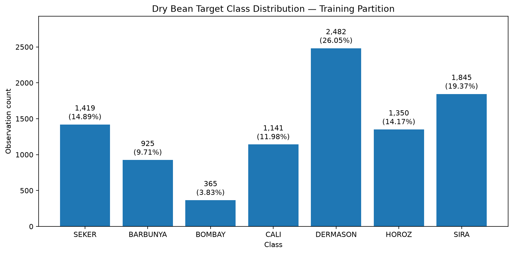
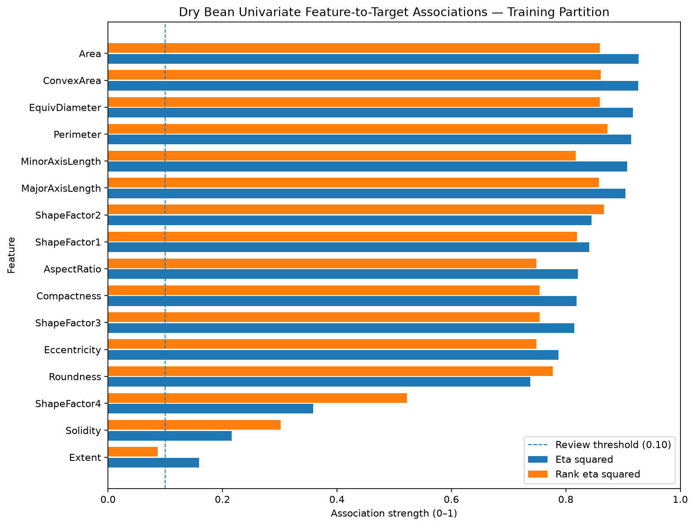
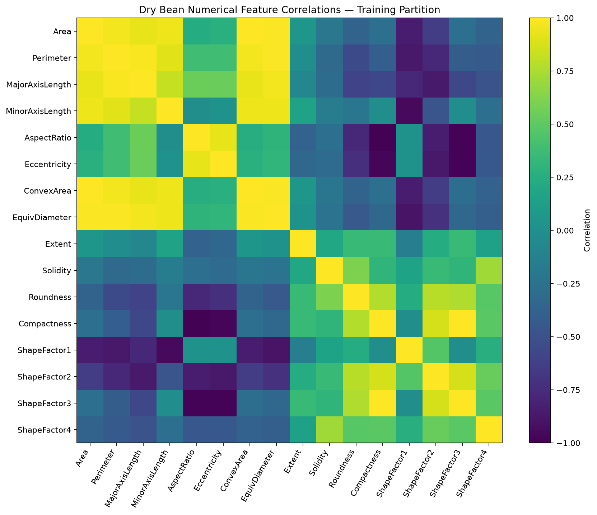
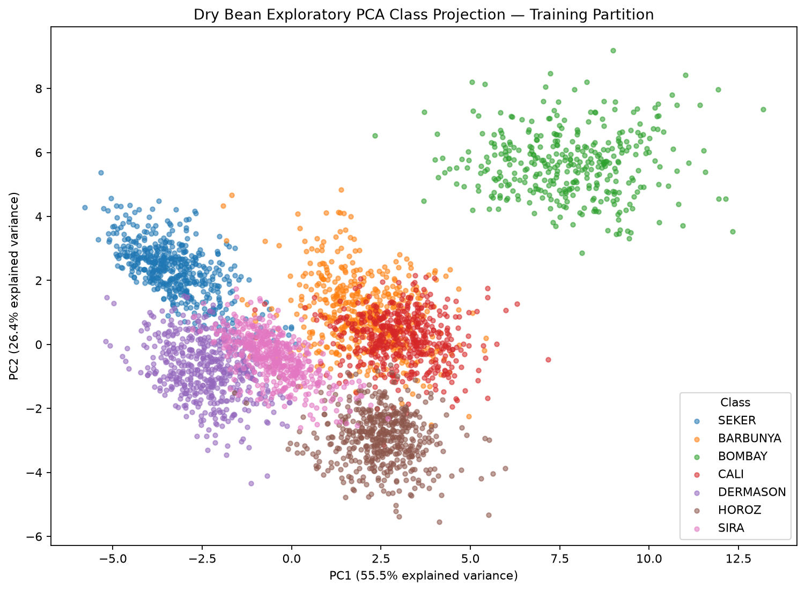
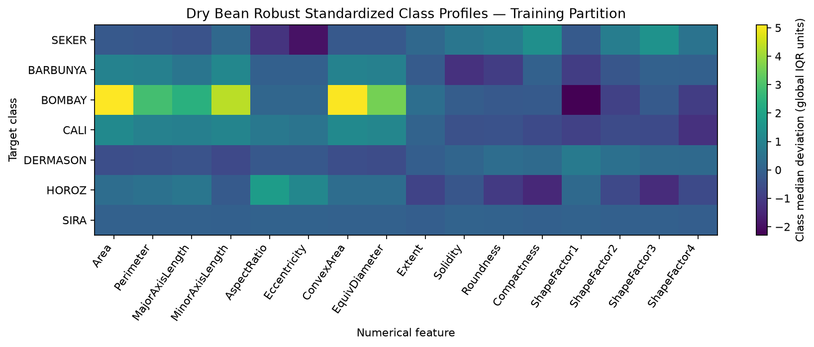
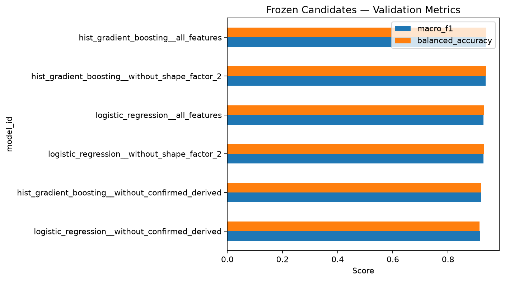
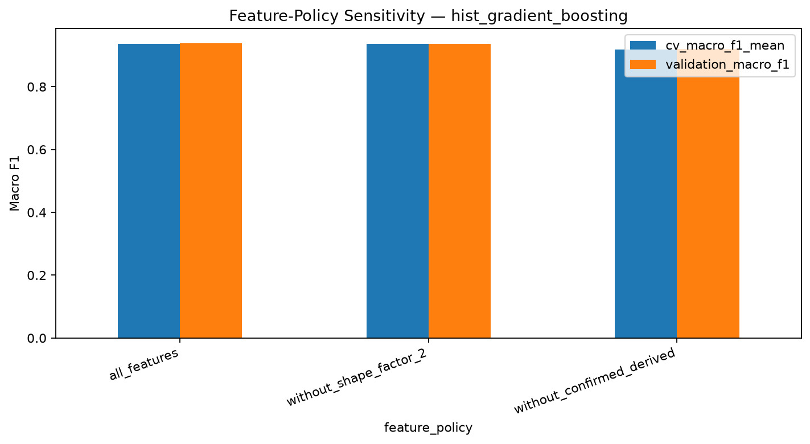
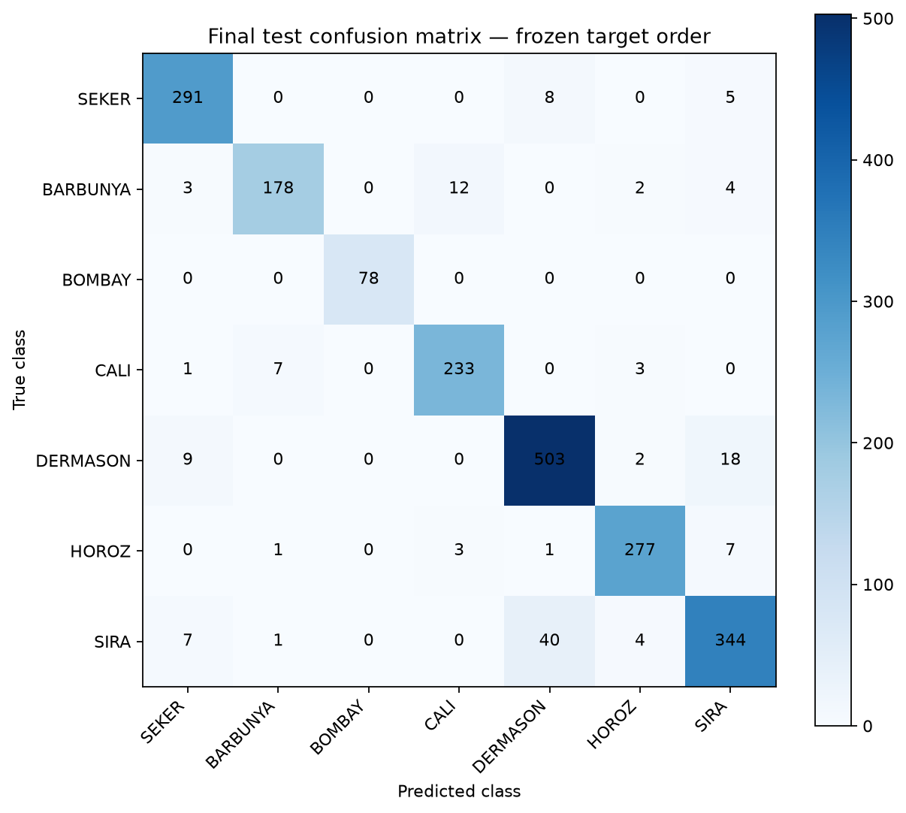
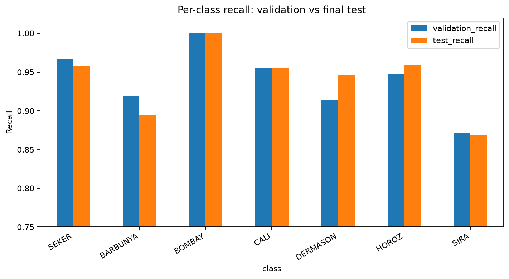
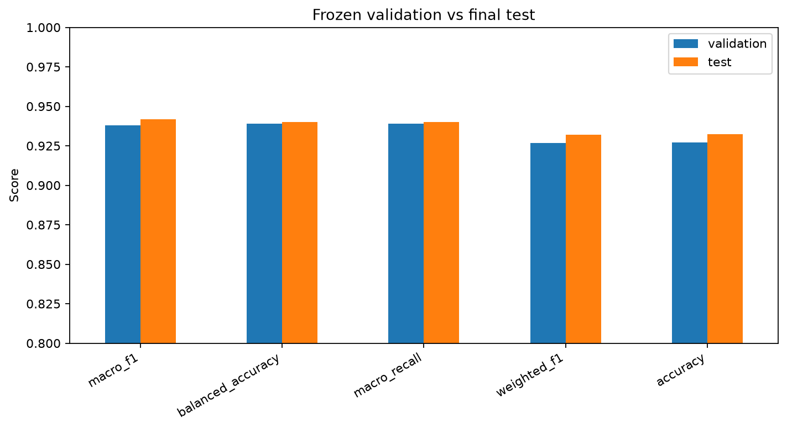

# Dry Bean — Dataset Study

End-to-end reproducible educational study of the UCI Dry Bean dataset, covering source validation, a split frozen before exploration, training-only exploratory evidence, deterministic preparation, multiclass model selection, feature-policy sensitivity, one-time final holdout evaluation, model bundling, and trusted independent inference.

## At a glance

| Item | Result |
|---|---:|
| Source | UCI Machine Learning Repository, dataset `602` |
| Source rows | 13,611 |
| Source columns | 17 |
| Predictive features | 16 numerical morphology features |
| Target | `Class` |
| Classes | 7 nominal, unordered bean varieties |
| Problem type | Multiclass classification |
| Exploration scope | Training partition only (9,527 rows) |
| Selected model | HistGradientBoostingClassifier |
| Selected feature policy | `all_features` |
| Primary metric | Macro F1 |
| CV macro F1 (train, 5-fold) | 0.937012 |
| Validation macro F1 | 0.937881 |
| Final-test macro F1 | **0.941835** |
| Final-test balanced accuracy | **0.939897** |
| Final-test accuracy | 0.932419 |
| Final-test log loss ↓ | 0.181024 |
| Canonical run manifest | [`reproducibility/canonical-run.json`](reproducibility/canonical-run.json) |
| Educational study complete | Yes |
| Operational modeling ready | No |

## Study objective

This repository documents a frozen educational multiclass-classification workflow for dry bean grain varieties. The objective is to determine how effectively numerical morphology measurements derived from images distinguish seven bean classes while preserving a clear separation between exploratory evidence, model selection, final evaluation, and inference.

The study is predictive rather than causal. Morphological associations describe statistical structure in the observed sample; they do not establish causal or agronomic effects.

The study does not claim production readiness, operational validity, temporal validity, external validity, or an implemented deployment/API surface.

## Dataset and source

The dataset is the UCI Machine Learning Repository **Dry Bean** dataset.

| Field | Value |
|---|---|
| UCI dataset ID | `602` |
| Repository URL | <https://archive.ics.uci.edu/dataset/602/dry+bean+dataset> |
| Dataset DOI | `10.24432/C50S4B` |
| Intro paper | *Multiclass classification of dry beans using computer vision and machine learning techniques* |
| Paper DOI | `10.1016/j.compag.2020.105507` |
| Source file SHA-256 | `1330e4ccc5c54a925e43daf60d1409ac62dad2a21de9a25213765bee4b655787` |

Each row represents one dry bean grain described by 16 numerical image-derived morphology measurements and one nominal target column, `Class`.

The official class order used by the study is:

```text
SEKER
BARBUNYA
BOMBAY
CALI
DERMASON
HOROZ
SIRA
```

The model operates on numerical measurements already extracted from images. The original image-acquisition, segmentation, and feature-extraction process is outside the scope of this study.

## Analytical question

The study addresses two related questions:

1. **How do the observed morphology profiles differ among the seven dry bean varieties?**
2. **How effectively can the 16 measurements classify previously unseen bean samples?**

The target is nominal and unordered. There is no positive class, no binary threshold, and no ordinal interpretation among varieties.

For prediction, the model estimates a probability distribution across the seven classes and returns the class with the largest score or probability.

## Feature and target contract

| Role | Columns |
|---|---|
| Target | `Class` |
| Numerical predictors | `Area`, `Perimeter`, `MajorAxisLength`, `MinorAxisLength`, `AspectRatio`, `Eccentricity`, `ConvexArea`, `EquivDiameter`, `Extent`, `Solidity`, `Roundness`, `Compactness`, `ShapeFactor1`, `ShapeFactor2`, `ShapeFactor3`, `ShapeFactor4` |
| Identifier | None provided by source |
| Categorical predictors | None |
| Positive class | Not applicable |
| Decision rule | `argmax_class_score_or_probability` |

The target is prohibited from model inputs.

Because the source provides no observation identifier, exact equality between two feature vectors is not treated as proof that the corresponding records represent the same physical bean.

## Experimental protocol and holdout boundary

The workflow separates what may touch the complete source from what may only touch development data:

```text
UCI acquisition and source identity
    -> structural validation on the complete source (row-wise rules, no learned parameters)
    -> stratified 70/15/15 split frozen and fingerprinted (seed 42)
    -> development EDA on the training partition only
    -> preparation (split reproduced and verified against the frozen fingerprints)
    -> model-family search and feature-policy sensitivity (train-only CV)
    -> validation comparison and freeze of every decision
    -> single final fit on train + validation
    -> single final-test evaluation
    -> serialization, bundle, and independent inference
```

- **Before the split** (Notebook 01, sections 2–9) only structural checks run on the complete table: source identity and schema, the declared target class set, row-wise domain rules, missing/invalid values, and exact-row structure. They have no learned parameters and cannot rank features, compare classes, or select models.
- **Split freeze** (Notebook 01, section 9b): the split policy is declared from structural facts only (static snapshot, nominal seven-class target, no source identifier). Partition row counts, partition hashes, and membership hashes are written to the exploration handoff.
- **Development exploration** (Notebook 01, sections 10–19) runs on the **training partition only**: class balance, numerical distributions, correlations and redundancy, feature-to-target association, class profiles and PCA, and derived-dependency confirmation. The exploration handoff rejects reports whose row counts differ from the training partition.
- **Preparation** (Notebook 02) re-executes the split and fails closed unless it reproduces the frozen fingerprints. It forwards the training-only feature-governance evidence (confirmed derived dependencies, unresolved provenance, highest-overlap class pair) to model selection through the feature manifest.
- **Model selection** (Notebook 03) builds its feature-policy ablations and the class-overlap hypothesis exclusively from that training-only evidence. Validation never enters CV or hyperparameter search; the test partition is never loaded.
- **Final evaluation** (Notebook 04) opens the test partition only after the frozen contract has been reconstructed and fitted, and evaluates it exactly once.

### Correction relative to the earlier execution

An earlier execution of this study ran the target-aware and distribution-aware exploration of Notebook 01 on the **complete** source before the split, so rows later assigned to the final test contributed to the exploratory evidence behind the feature-policy design. The protocol above corrects that boundary; the earlier results are retained in the canonical manifest only as a superseded, non-canonical reference.

The corrected run reproduced the earlier numbers exactly. This is expected and explainable rather than forced: the split depends only on the pre-declared seed and the source rows (not on exploration), so the partitions are byte-identical; training-only exploration re-derived the same decision basis (the same nine confirmed derived dependencies, `ShapeFactor2` unresolved, `BARBUNYA`/`CALI` as the highest-overlap pair); and the candidate space, metric, tie rules, and seeds were unchanged.

The same seed-42 test partition was therefore also evaluated once by the superseded execution. No development decision was changed after that historical test result, but this partition cannot be described as never having been opened before; see [Limitations](#limitations).

## Data quality and preparation

The prepared dataset preserves the source shape exactly.

| Check | Result |
|---|---:|
| Source rows | 13,611 |
| Prepared rows | 13,611 |
| Source columns | 17 |
| Prepared columns | 17 |
| Row removal | None |
| Generic imputation | None |
| Automatic outlier deletion | None |
| Deterministic materialization rules | None |
| Candidate features retained | 16 of 16 |
| Learned preprocessing in preparation | None |

The static split is stratified with random seed `42` (second stage seed `43`):

| Partition | Rows | Role |
|---|---:|---|
| Train | 9,527 | Development EDA, family search, cross-validation, and feature-policy analysis |
| Validation | 2,042 | Frozen candidate comparison and selection |
| Final test | 2,042 | One-time final holdout evaluation after all decisions are frozen |

The final-test partition is not loaded until the final model family, hyperparameters, feature policy, and imbalance policy have been frozen and the final model has been fitted.

Repeated feature profiles are preserved. The source contains 68 exact-row equality groups; 31 of them span more than one partition and none maps to conflicting classes. Repeated-profile analysis is treated only as sensitivity evidence; it does not establish duplicate identity or leakage.

## Class distribution

| Class | Train | Validation | Final test |
|---|---:|---:|---:|
| `SEKER` | 1,419 | 304 | 304 |
| `BARBUNYA` | 925 | 198 | 199 |
| `BOMBAY` | 365 | 79 | 78 |
| `CALI` | 1,141 | 245 | 244 |
| `DERMASON` | 2,482 | 532 | 532 |
| `HOROZ` | 1,350 | 289 | 289 |
| `SIRA` | 1,845 | 395 | 396 |

In the training partition, `DERMASON` is the majority class and `BOMBAY` is the minority class. The majority/minority support ratio is `6.8`, and normalized class entropy is approximately `0.942706`.



Because each class should contribute equally to model selection despite unequal support, **Macro F1** is the primary metric.

## Exploratory evidence (training partition)

All figures and statistics in this section are computed on the 9,527 training rows only.

Several numerical morphology measurements show strong univariate association with `Class`.



These associations are descriptive. They indicate that morphology contains predictive signal but do not establish that any individual measurement independently determines bean variety.

The numerical measurements are not independent. Several variables are mathematically related or strongly correlated.



Nine derived dependencies are numerically confirmed on every training row:

```text
AspectRatio
Eccentricity
EquivDiameter
Solidity
Roundness
Compactness
ShapeFactor1
ShapeFactor3
ShapeFactor4
```

`ShapeFactor2` remains a distinct provenance case: its audited source formula is not numerically confirmed at the configured tolerance. Its `provenance_status` is therefore `unresolved`, which does **not** mean the feature is invalid. `Extent` depends on a bounding-box area that the source does not retain, so it cannot be audited.

The PCA projection is exploratory visualization only.



It shows meaningful separation alongside overlap among some varieties; the greatest central-profile overlap is `BARBUNYA` vs `CALI`. It must not be interpreted as a classifier, a causal mechanism, or a replacement for the full 16-dimensional predictive problem.



## Evaluation protocol

**Macro F1** is the primary model-selection metric. Complementary evidence includes Balanced Accuracy, Macro Recall, Weighted F1, contextual Accuracy, per-class metrics, confusion evidence, and multiclass Log Loss.

Candidate-family search uses training-only five-fold stratified cross-validation:

```text
StratifiedKFold
n_splits = 5
shuffle = True
random_state = 42
```

A candidate must exceed the Dummy validation Macro F1 by more than `0.02`.

A practical validation tie is defined as a Macro-F1 difference of at most `0.002`. Practical ties are resolved using predefined evidence in this order: balanced accuracy, worst-class recall, cross-validation stability, comparable log loss, model simplicity, and stable model identity.

No test evidence participates in model selection.

## Model selection

Model selection occurs in two stages:

1. four model families are searched and ranked using training-only cross-validation;
2. the two strongest families are evaluated under controlled feature policies before validation selection.

Decision Tree and Random Forest do not receive the later validation-policy evaluation because they do not enter the CV-only shortlist.

### Candidate-family comparison

| Model family | Search | Evaluated configurations | CV Macro F1 mean ± std | CV Balanced Accuracy | CV Weighted F1 | CV Log Loss ↓ | Outcome |
|---|---|---:|---:|---:|---:|---:|---|
| HistGradientBoostingClassifier | RandomizedSearchCV | 8 of 64 | **0.937012 ± 0.003825** | **0.935424** | **0.924310** | 0.258114 | **Shortlisted** |
| LogisticRegression | GridSearchCV | 4 of 4 | 0.935031 ± 0.000996 | 0.933826 | 0.922071 | **0.218538** | **Shortlisted** |
| RandomForestClassifier | RandomizedSearchCV | 8 of 24 | 0.933343 ± 0.003635 | 0.931656 | 0.921274 | 0.342768 | Candidate |
| DecisionTreeClassifier | GridSearchCV | 8 of 8 | 0.919904 ± 0.009698 | 0.920557 | 0.908862 | 0.662884 | Candidate |

### Candidate search configuration and hyperparameters

| Model | Search policy | Search space / fixed configuration |
|---|---|---|
| Logistic Regression | GridSearchCV, 4/4 configurations | `C={0.1,1.0}`; `class_weight={None,balanced}`; fixed `solver=lbfgs`, `max_iter=2000`, `random_state=42`; `StandardScaler` fitted inside each fold |
| Decision Tree | GridSearchCV, 8/8 configurations | `max_depth={8,None}`; `min_samples_leaf={1,5}`; `class_weight={None,balanced}`; fixed `random_state=42` |
| Random Forest | RandomizedSearchCV, 8/24 configurations | `n_estimators={120,240}`; `max_depth={None,16}`; `min_samples_leaf={1,3}`; `class_weight={None,balanced,balanced_subsample}`; fixed `random_state=42`, `n_jobs=1` |
| HistGradientBoosting | RandomizedSearchCV, 8/64 configurations | `learning_rate={0.05,0.1}`; `max_iter={150,250}`; `max_leaf_nodes={15,31}`; `min_samples_leaf={20,40}`; `l2_regularization={0.0,1.0}`; `class_weight={None,balanced}`; fixed `random_state=42` |
| Dummy prior | No search | `strategy=prior` |

The best CV configuration of every family, including non-selected ones, is recorded in the canonical manifest.

### Feature-policy sensitivity

The two shortlisted families are evaluated with their frozen family-search parameters under three feature policies built from training-only exploration evidence: all 16 predictors, all except the unresolved-provenance `ShapeFactor2`, and seven predictors after removing the nine derived features confirmed on the training partition.

| Frozen candidate | Features | CV Macro F1 mean ± std | Validation Macro F1 | Balanced Accuracy | Worst recall | Log Loss ↓ |
|---|---:|---:|---:|---:|---:|---:|
| HistGradientBoosting — all features | 16 | **0.937012 ± 0.003825** | **0.937881** | **0.939131** | **0.870886** | 0.225172 |
| HistGradientBoosting — without ShapeFactor2 | 15 | 0.936167 ± 0.004014 | 0.936677 | 0.938146 | 0.863291 | 0.229580 |
| Logistic Regression — all features | 16 | 0.935031 ± 0.000996 | 0.928973 | 0.930908 | 0.863291 | **0.222511** |
| Logistic Regression — without ShapeFactor2 | 15 | 0.934860 ± 0.001422 | 0.928917 | 0.930814 | 0.860759 | 0.223445 |
| HistGradientBoosting — without confirmed derived | 7 | 0.918302 ± 0.004924 | 0.919956 | 0.920909 | 0.858586 | 0.278823 |
| Logistic Regression — without confirmed derived | 7 | 0.919941 ± 0.002835 | 0.915406 | 0.914790 | 0.838384 | 0.271961 |

The Dummy validation Macro F1 is `0.059052`.

The two HistGradientBoosting candidates with and without `ShapeFactor2` form a practical validation tie (Macro-F1 difference `0.001204` ≤ `0.002`). The tie is resolved by the first predefined criterion, higher validation balanced accuracy, in favour of `all_features`.



### Selected model and configuration

The selected candidate is `hist_gradient_boosting__all_features`.

| Hyperparameter | Value |
|---|---:|
| `class_weight` | `None` |
| `learning_rate` | 0.05 |
| `max_iter` | 250 |
| `max_leaf_nodes` | 15 |
| `min_samples_leaf` | 40 |
| `l2_regularization` | 0.0 |
| `random_state` | 42 |

All 16 numerical features are retained. Numerical scaling is not used, no resampling is introduced, and the final decision rule is `argmax_class_score_or_probability`.

## Feature-retention evidence

Removing `ShapeFactor2` from HistGradientBoosting changes validation Macro F1 from `0.937881` to `0.936677`, a delta of approximately `-0.001204`.

This is predictive sensitivity evidence only. It does not resolve or invent the source provenance of `ShapeFactor2`.

Removing the nine confirmed derived features reduces validation Macro F1 from `0.937881` to `0.919956`, a delta of approximately `-0.017925`.

The evidence therefore supports retaining all 16 features for the frozen educational model.



## Final holdout evaluation

After all selection decisions are frozen, the selected model is fitted once on **train + validation** (11,569 rows) and the final-test partition is loaded and evaluated once.

| Metric | Validation | Final test | Test − validation |
|---|---:|---:|---:|
| Macro F1 | 0.937881 | **0.941835** | +0.003954 |
| Balanced Accuracy | 0.939131 | **0.939897** | +0.000766 |
| Macro Recall | 0.939131 | **0.939897** | +0.000766 |
| Weighted F1 | 0.926899 | **0.932187** | +0.005288 |
| Accuracy | 0.927032 | **0.932419** | +0.005387 |
| Log Loss ↓ | 0.225172 | **0.181024** | -0.044148 |
| Minimum per-class recall | 0.870886 | **0.868687** | -0.002199 |

The final-test partition contains 2,042 observations and is evaluated exactly once in the canonical run. It is not used for retuning, feature-policy changes, imbalance-policy changes, or model-family changes.

### Per-class final-test results

| Class | Precision | Recall | F1 | Support |
|---|---:|---:|---:|---:|
| `SEKER` | 0.935691 | 0.957237 | 0.946341 | 304 |
| `BARBUNYA` | 0.951872 | 0.894472 | 0.922280 | 199 |
| `BOMBAY` | 1.000000 | 1.000000 | 1.000000 | 78 |
| `CALI` | 0.939516 | 0.954918 | 0.947154 | 244 |
| `DERMASON` | 0.911232 | 0.945489 | 0.928044 | 532 |
| `HOROZ` | 0.961806 | 0.958478 | 0.960139 | 289 |
| `SIRA` | 0.910053 | 0.868687 | 0.888889 | 396 |

`SIRA` is the class with the lowest final-test recall.



The focal confusion pairs are fixed before test access: the largest validation confusion pair and the training-only highest-overlap pair.

| Pair | Validation mutual errors | Final-test mutual errors |
|---|---:|---:|
| `DERMASON` ↔ `SIRA` | 68 | 58 |
| `BARBUNYA` ↔ `CALI` | 21 | 19 |

The exploratory overlap hypothesis (HYP-002) is `partially_supported`: `BARBUNYA` ↔ `CALI` ranks second among validation confusion pairs.





### Repeated-profile sensitivity

Fifteen final-test rows have a feature profile also observed in train + validation, leaving 2,027 rows in the descriptive sensitivity subset.

| Evaluation | Macro F1 |
|---|---:|
| Official full final test | 0.941835 |
| Excluding repeated-profile rows | 0.941523 |
| Delta | -0.000312 |

The official evaluation is unchanged. This result does not establish duplicate identity or leakage.

## Independent multiclass inference

The final inference input requires the same 16 numerical features used by the selected model. Missing required values are rejected, and `Class` is prohibited as an input.

The output contains `predicted_class`, `class_order`, and `class_probabilities`.

The decision rule is `argmax_class_score_or_probability`. There is no positive class, binary threshold, or operational probability cutoff.

The fitted estimator's internal class order is:

```text
BARBUNYA
BOMBAY
CALI
DERMASON
HOROZ
SEKER
SIRA
```

The official output class order is:

```text
SEKER
BARBUNYA
BOMBAY
CALI
DERMASON
HOROZ
SIRA
```

Probabilities are explicitly realigned from estimator order to official output order before presentation. Notebook 05 loads the SHA-256-verified final artifact in a fresh kernel; its fixed demonstration inputs come from the training partition.

## Workflow and notebooks

```text
Raw UCI snapshot
    -> 01 structural source validation, split freeze, and training-only exploration
    -> 02 deterministic preparation and verification of the frozen split
    -> 03 model-family search, feature-policy sensitivity, and frozen selection
    -> 04 final train+validation fit and one-time test evaluation
    -> 05 independent inference demonstration
```

Each notebook consumes persisted upstream artifacts rather than relying on live variables from a previous notebook. The versioned notebooks are clean sources (no outputs, no execution counts).

## Project structure

```text
.python-version     Exact CPython version of the canonical run (single source of truth)
pyproject.toml      Project metadata, requires-python, direct dependencies, dependency groups
pylock.toml         Machine-generated PEP 751 lock of the canonical environment
artifacts/          Artifact documentation and ignored runtime outputs
data/               Data documentation and ignored raw/processed datasets
docs/images/        Curated versionable figures for documentation
notebooks/          Five authoritative study notebooks
reproducibility/    Canonical run manifest (derived evidence of the reference execution)
scripts/            Reusable validation, analysis, selection, finalization, and inference code
tests/              Unit and contract tests
```

Some reusable modules and tests also cover binary-classification paths shared with sibling dataset studies; the Dry Bean workflow uses the multiclass paths.

## Environment

The environment follows the common Dataset Study contract. Each file has one role:

| File | Role |
|---|---|
| [`.python-version`](.python-version) | Exact CPython version (`X.Y.Z`) of the canonical reproducible run |
| [`pyproject.toml`](pyproject.toml) | Human-declared contract: `requires-python`, direct dependencies, and dependency groups |
| [`pylock.toml`](pylock.toml) | Machine-generated [PEP 751](https://peps.python.org/pep-0751/) lock with every direct and transitive package, pinned with SHA-256 hashes |

Dependency roles in `pyproject.toml`:

| Declaration | Contents | In the lock |
|---|---|---|
| `dependencies` | numpy, pandas, scikit-learn, joblib, ucimlrepo, matplotlib (used by the plotting helpers in `scripts/`) | Yes |
| group `notebook` | ipykernel, nbconvert: headless notebook execution | Yes |
| group `test` | pytest | Yes |
| group `interactive` | jupyterlab: optional interactive authoring | No |
| group `dev` | `notebook` + `test` + `interactive` | Partly |

The runtime versions stored in `reproducibility/canonical-run.json`, the model bundle, and the handoffs record what one execution observed. They are evidence, not configuration. `python -m scripts.canonical_run` reads the expected interpreter from `.python-version` and the expected package versions from `pylock.toml`. It refuses to `build` a canonical manifest in any other environment.

### Create and install the locked environment

The lock is universal: it covers Linux, macOS, and Windows through environment markers. It was generated with `uv` 0.12.19 and installed and tested with `pip` 26.2.1 on Linux aarch64. `pip` currently labels `pylock.toml` input as experimental.

```bash
python"$(cut -d. -f1,2 .python-version)" --version   # must print the version in .python-version
python"$(cut -d. -f1,2 .python-version)" -m venv .venv
. .venv/bin/activate
python -m pip install --upgrade "pip>=26.2"
python -m pip install -r pylock.toml          # hash-checked, no re-resolution
python -m pip install -e . --no-deps          # the study code itself
python -m pip check                           # dependency integrity
```

Equivalent with `uv`: `uv venv --python "$(cat .python-version)" && uv pip sync pylock.toml && uv pip install -e . --no-deps`.

For development without the exact lock, `python -m pip install -e . --group dev` resolves compatible versions from `pyproject.toml`.

Optional Jupyter kernel:

```bash
python -m ipykernel install --user \
  --name dataset-study-dry-bean \
  --display-name "Python (dataset-study-dry-bean)"
```

### Updating the lock

Never edit `pylock.toml` by hand. Regenerate it from `pyproject.toml` and `.python-version`:

```bash
uv pip compile pyproject.toml --group notebook --group test --universal \
  --python-version "$(cat .python-version)" -o pylock.toml
```

`uv pip compile` keeps the versions already in `pylock.toml` unless `--upgrade` is passed, so rerunning this command reproduces the same lock. After any deliberate upgrade, re-execute the whole study and rebuild the canonical manifest.

### Removing the local environment

```bash
deactivate
rm -rf .venv
```

This removes only the interpreter environment. Versioned results (`reproducibility/`, `docs/images/`) and ignored runtime outputs (`data/`, `artifacts/`) are left untouched.

## Reproducing the study

Notebook 01 acquires the UCI dataset automatically when `data/raw/dry-bean/` is absent (network access to the UCI repository is required once). It can also be acquired explicitly:

```bash
python -m scripts.download_data uci \
  602 \
  --destination data/raw/dry-bean
```

Execute notebooks in order from 01 to 05 starting without runtime artifacts. To preserve clean source notebooks, execute copies rather than using `--inplace`:

```bash
jupyter nbconvert --to notebook --execute notebooks/01_data_understanding_and_exploration.ipynb --output-dir build/executed
jupyter nbconvert --to notebook --execute notebooks/02_data_preparation.ipynb --output-dir build/executed
jupyter nbconvert --to notebook --execute notebooks/03_model_selection_and_evaluation.ipynb --output-dir build/executed --ExecutePreprocessor.timeout=3600
jupyter nbconvert --to notebook --execute notebooks/04_final_model_and_bundle.ipynb --output-dir build/executed
jupyter nbconvert --to notebook --execute notebooks/05_inference_demo.ipynb --output-dir build/executed
```

Executed copies under `build/` are ignored by Git. Artifact writers are fail-closed: an existing divergent artifact set is never overwritten, so delete `artifacts/*/dry-bean/` and `data/processed/dry-bean/` before a full re-execution.

Compare the fresh run with the canonical reference:

```bash
python -m scripts.canonical_run verify
```

The verifier requires exact equality for source and partition hashes, class and feature order, seeds, the selected model, hyperparameters, and the final-test confusion matrix. Metrics must agree within `1e-9`. Model-artifact and probability hashes must also match when the runtime equals the reference runtime; under a different runtime they are reported but not required. The report also states whether the current environment matches `.python-version` and `pylock.toml`.

Known third-party warning: with the locked joblib 1.5.3 and NumPy 2.5, loading pickled arrays emits a NumPy `DeprecationWarning` ("Setting the shape on a NumPy array"). It is fixed upstream in joblib 1.6.0. It is left visible and unsuppressed so that the locked environment stays the one that produced the manifest.

## Tests

```bash
PYTHONPATH=. python -m pytest -q
```

## Reproducibility and integrity

The project preserves deterministic seeds, source, split, and membership fingerprints, persisted handoff contracts, artifact hashes, model serialization checks, fresh-process inference validation, a hash-pinned PEP 751 environment lock, and a versioned canonical run manifest.

Raw data, processed data, model binaries, and runtime artifacts remain outside the normal versioned workflow. Curated documentation figures are versioned under `docs/images/`, and the canonical run manifest under `reproducibility/`.

## Limitations

- The evaluation is a stratified random-snapshot benchmark rather than a temporal, prospective, or external validation.
- External representativeness is not established.
- The lock is universal, but the canonical execution and the clean-state reproduction were verified only on Linux aarch64; bit-identical model and probability hashes on other platforms are not established.
- The seed-42 final-test partition was also evaluated once by a superseded execution whose exploration used the complete source. The corrected protocol re-derived every decision from training-only evidence without changing the pre-declared seed, candidate space, metric, or tie rules, but the partition is not a never-before-opened holdout, and author-level exposure to the earlier full-source exploration cannot be undone.
- The model receives numerical features derived from images; the upstream image-acquisition and feature-extraction pipeline is not evaluated.
- Operational availability and stability of the 16 measurements are unconfirmed.
- `ShapeFactor2` source provenance remains unresolved at the study's numerical formula tolerance.
- Exact equality between feature profiles cannot prove duplicate physical grains because the source contains no observation identifier.
- Class probabilities are not established as universally calibrated measures of biological certainty.
- Morphological overlap remains between several classes.
- Distribution shift across equipment, environments, cultivars, populations, or acquisition protocols is not evaluated.
- No production monitoring or drift policy is established.
- No industrial or commercial error-cost analysis is included.
- Exploratory associations must not be interpreted as causal or agronomic effects.
- Operational modeling readiness and operational validity remain unconfirmed.

## Responsible interpretation

The evidence supports a clear predictive conclusion:

> Numerical measurements of bean size and shape contain strong information for distinguishing seven dry bean varieties in this dataset. A HistGradientBoostingClassifier using all 16 morphology features achieves a final-test Macro F1 of approximately **0.9418** and Balanced Accuracy of approximately **0.9399** under the frozen stratified random-snapshot evaluation protocol.

Four trainable model families are compared under training-only cross-validation. HistGradientBoostingClassifier and LogisticRegression form the CV shortlist, after which controlled feature-policy analysis supports retaining all 16 features and selecting HistGradientBoostingClassifier.

The final result demonstrates effective classification within the observed dataset and evaluation protocol. It does not establish causal morphology-to-variety relationships or guarantee equivalent performance under different measurement pipelines, populations, or operating conditions.

Any use beyond this analytical setting would require independent validation of the complete measurement pipeline, representative external data, probability behavior, distribution stability, monitoring requirements, and application-specific error costs.

## Source and citation

Use the UCI dataset and paper metadata above when citing the source.

- Dataset DOI: `10.24432/C50S4B`
- Intro paper: *Multiclass classification of dry beans using computer vision and machine learning techniques*
- Paper DOI: `10.1016/j.compag.2020.105507`
